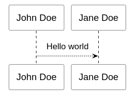

[](https://npmjs.org/package/pandoc-plantuml "View this project on npm")
[](https://david-dm.org/masquerade-circus/pandoc-plantuml)


[](https://github.com/masquerade-circus/pandoc-plantuml/blob/master/LICENSE)

# Pandoc PlantUML

`pandoc-plantuml` is a pandoc filter that allows you to write [PlantUML](http://plantuml.com/en/) diagrams in your markdown files and convert them to inline images. 

It makes use of its [demo online tool](http://www.plantuml.com/plantuml/uml/SyfFKj2rKt3CoKnELR1Io4ZDoSa70000), so, if you like this filter, go to [PlantUML](http://plantuml.com/en/) site and support them.

## Install

This is a [Node.js](https://nodejs.org/en/) module available through the [npm registry](https://www.npmjs.com/), so, you will need [Node.js](https://nodejs.org/en/) installed first.

    // With npm
    $ npm install -g pandoc-plantuml
    // With yarn
    $ yarn global add pandoc-plantuml

## Use

### Apply filter

To apply the filter to your markdown conversion just add it to your command like this:

```code
pandoc -t html -F pandoc-plantuml -o my-file.html my-file.md
```

### Graph definition

To add a graph simply create a `plantuml` code block and follow the format of PlantUML. It must contain the `@startuml` and `@enduml` tags at the start and end respectively. 

````code


```plantuml
@startuml
participant John as "John Doe"
participant Jane as "Jane Doe"

John --> Jane: Hello world
@enduml
` ``
````

![Simple diagram](imgs/simple.png)

### Style support

You can add any [skinparam](http://plantuml.com/en/skinparam) to style your diagram like this.

````code
```plantuml
@startuml
skinparam {
  RoundCorner 5
  Shadowing false
  ArrowColor Black
  ArrowFontSize 16
  Padding 8
  WrapWidth 1024
  note {
    BackgroundColor OldLace
    BorderColor BurlyWood
    FontSize 16
  }
  sequence {
    LifeLineBorderColor Black
    LifeLineBackgroundColor White
    MessageAlignment center
    Participant {
      BorderColor Black
      BorderThickness 0.5
      BackgroundColor White
      FontSize 18
    }
  }
}

participant John as "John Doe"
participant Jane as "Jane Doe"

John --> Jane: Hello world
@enduml
` ``
````

![Styled diagram](imgs/styled.png)

### `.skinparam.iuml`

For convenience `pandoc-plantuml` will search for a `.skinparam.iuml` file in the root folder of your project. You can add your styles in this file and will be applied to all your diagrams.

Add a `.skinparam.iuml` file

```code
skinparam {
  RoundCorner 5
  Shadowing false
  ArrowColor Black
  ArrowFontSize 16
  Padding 8
  WrapWidth 1024
  note {
    BackgroundColor OldLace
    BorderColor BurlyWood
    FontSize 16
  }
  sequence {
    LifeLineBorderColor Black
    LifeLineBackgroundColor White
    MessageAlignment center
    Participant {
      BorderColor Black
      BorderThickness 0.5
      BackgroundColor White
      FontSize 18
    }
  }
}
```

Then create a diagram

````code
```plantuml
@startuml
participant John as "John Doe"
participant Jane as "Jane Doe"

John --> Jane: Hello world
@enduml
` ``
````

And you will get



## Limitations

Local conversion is not posible at this moment so, including files will not work, but pull requests are welcome.

## Contributing

-   Use prettify and eslint to lint your code.
-   Update the readme with an example if you add or change any functionality.

## Legal

Author: [Masquerade Circus](http://masquerade-circus.net). License [Apache-2.0](https://opensource.org/licenses/Apache-2.0)
